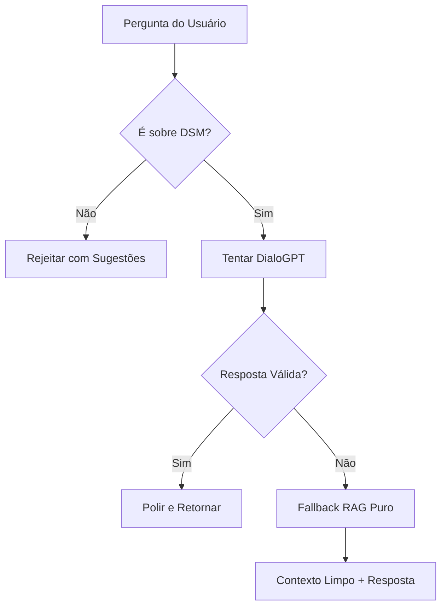

# Explicação do Projeto DSM Chatbot - Versão Melhorada

Este projeto implementa um chatbot **altamente especializado** em Desenvolvimento de Sistemas Multiplataforma (DSM) usando a arquitetura RAG (Retrieval-Augmented Generation) **aprimorada**. O sistema combina recuperação inteligente de informações, validação rigorosa de escopo e geração de linguagem natural para fornecer respostas precisas, limpas e exclusivamente focadas em desenvolvimento mobile.

## 🆕 Melhorias Implementadas (Setembro 2025)

### ✅ **Validação de Escopo DSM**

- **Detecção automática** de palavras-chave mobile (React Native, Flutter, Android, iOS, etc.)
- **Rejeição educada** de perguntas não relacionadas ao desenvolvimento mobile
- **Lista de especialidades** apresentada quando escopo é violado

### ✅ **Validação de Qualidade DialoGPT**

- **Detecção de nonsense** (pupupu, lalala, etc.)
- **Verificação de repetição** excessiva
- **Filtros de conteúdo técnico** relevante

### ✅ **Limpeza Automática de Contexto RAG**

- **Remoção de títulos** em maiúscula desnecessários
- **Limpeza de formatação** que polui as respostas
- **Contexto puro** e focado no conteúdo técnico

## Como Funciona o RAG

1. **Indexação**: O material do curso DSM é dividido em "chunks" (pedaços) menores
2. **Embeddings**: Cada chunk é convertido em vetores numéricos usando `sentence-transformers`
3. **Busca**: Para cada pergunta, o sistema encontra os chunks mais relevantes usando FAISS
4. **Geração**: O contexto recuperado é enviado junto com a pergunta para um modelo de linguagem gerar a resposta

## Arquitetura do Sistema

### Arquivos Principais

- **`src/rag/retriever.py`**: Sistema de recuperação com FAISS e embeddings
  - Constrói índice vetorial dos documentos
  - Implementa busca semântica eficiente
  - Cache inteligente para performance

- **`src/llm/model.py`**: Wrapper para geração com Transformers
  - Integração com modelos Hugging Face
  - Sistema de fallback para respostas robustas
  - Validação de qualidade das respostas geradas

- **`src/main.py`**: Interface de linha de comando
  - Loop de interação com o usuário
  - Gerenciamento de histórico de conversa
  - Integração entre RAG e LLM

- **`src/rag/chunking.py`**: Processamento de texto
  - Divisão inteligente em chunks
  - Preservação de contexto semântico

- **`src/utils/preprocessing.py`**: Utilitários de limpeza de texto

## Tecnologias Utilizadas

### Modelos e Bibliotecas

- **`sentence-transformers/all-MiniLM-L6-v2`**: Modelo para embeddings
  - Rápido e leve (22MB)
  - Boa performance para português
  - Otimizado para busca semântica

- **`microsoft/DialoGPT-small`**: Modelo de linguagem conversacional
  - Especializado em diálogos
  - Melhor que modelos GPT básicos para conversas
  - Tamanho equilibrado (351MB)

- **FAISS**: Biblioteca de busca vetorial do Facebook
  - Busca eficiente em milhões de vetores
  - IndexFlatL2 para precisão máxima
  - Suporte a GPU quando disponível

### Recursos Implementados

- **Sistema de Fallback**: Respostas inteligentes quando o modelo falha
- **Validação de Qualidade**: Detecção de respostas sem sentido
- **Cache Persistente**: Embeddings salvos para reuso
- **Histórico de Conversa**: Contexto mantido entre interações
- **Tratamento de Erros**: Recuperação graceful de falhas

## 📈 Melhorias de Performance e Arquitetura

### 🔧 **Sistema Híbrido Inteligente**

1. **DialoGPT com Validação** → Primeira tentativa com modelo conversacional
2. **Validação de Qualidade** → Detecta e rejeita respostas nonsense  
3. **Fallback RAG Puro** → Sistema limpo baseado apenas em contexto

### 🎯 **Fluxo de Decisão Melhorado**

### 🛡️ **Validações Implementadas**

- **Escopo DSM:** 25+ palavras-chave mobile
- **Qualidade:** Detecção de patterns nonsense (pupupu, lalala, etc.)
- **Conteúdo:** Verificação de relevância técnica
- **Formatação:** Limpeza automática de títulos e símbolos

## Dados do Projeto

O arquivo `data/dsm_material.txt` contém material abrangente sobre:

- Frameworks multiplataforma (React Native, Flutter, Ionic, Xamarin)
- Arquiteturas de software móvel (MVC, MVVM, Clean Architecture)
- Testes e qualidade (unitários, integração, E2E)
- Performance e otimização
- CI/CD e deployment
- Gerenciamento de estado
- Boas práticas e ferramentas

## Limitações e Considerações

- **Modelo de Linguagem**: DialoGPT-small pode ter limitações para respostas muito complexas
- **Idioma**: Melhor performance em inglês, mas funciona bem em português
- **Contexto**: Limitado pelo tamanho da janela de contexto do modelo
- **Offline**: Requer internet apenas no primeiro download dos modelos

## Extensões Possíveis

- Interface web com Flask/FastAPI
- Integração com APIs de LLMs maiores (OpenAI, Anthropic)
- Suporte a documentos PDF e múltiplas fontes
- Sistema de feedback para melhorar respostas
- Deploy em containers Docker
